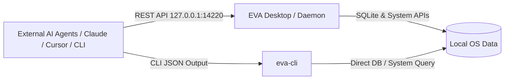

# EVA (桌面工作台与本地上下文感知系统)

[](LICENSE)
[](https://github.com/lepfinder/eva/releases/latest)
[](https://github.com/lepfinder/eva/releases/latest)
[](https://github.com/lepfinder/eva/releases)
[](https://github.com/lepfinder/eva/stargazers)
[](https://github.com/lepfinder/eva/actions/workflows/ci.yml)

EVA 是一款专为开发者与 AI Agent 打造的**个人本地化智能桌面工作台与上下文感知系统**。基于 **Tauri 2 + Rust + React + TypeScript** 构建，深度整合系统级活动追踪、剪贴板历史、本地环境感知与轻量 REST / CLI 接口。

---

[核心特性](#核心特性) | [AI Agent 友好生态](#ai-agent-友好生态) | [下载与安装](#下载与安装) | [快速上手](#快速上手) | [本地 API](#本地-api) | [CLI 工具](#cli-工具) | [数据存储](#数据存储)

---

## ✨ 核心特性

- ⏱️ **智能活动追踪（Activity Tracker）**：自动感知前台聚焦应用与窗口，分析日常时间投入与生产力趋势热力图。
- 📋 **全功能剪贴板历史（Clipboard Manager）**：多类型智能识别（Text / Image / Color / Code / HTML / Link），毫秒级搜索与快速回填。
- 📸 **视觉记忆回溯（Visual Recall）**：低开销屏幕快照时间线，帮助快速找回过去的屏幕工作状态。
- 🛠️ **本地开发环境感知（Dev Tools & Ports）**：一键检测本地工具链（Node, Rust, Python, Docker 等）与本地监听端口占用。
- 🤖 **面向 AI Agent 的双模接入**：同时提供 **Loopback REST API** 与 **独立 CLI 二进制（`eva-cli`）**，零门槛为任何 AI Agent 提供精准桌面上下文。
- 🎨 **现代化精致 UI**：暗色模式、精美可视化图表、平滑动画与快捷键支持。

---

## 🤖 AI Agent 友好生态

EVA 不仅仅是一个桌面工具，更是外部 AI Agent 理解你当前工作环境的**本地大脑连接器**。

- **极速低开销**：提供原生 Rust CLI 工具与本地 Loopback REST API，支持 JSON / Compact 紧凑输出，最大程度节省 Agent Token 消耗。
- **只读安全隔离**：默认绑定本地回环地址（`127.0.0.1:14220`），支持 Token 鉴权与本地免 Token 模式，数据永不上云。
- **全景上下文聚合**：单次调用即可获取「当前活跃窗口 + 最近复制内容 + 本地开发端口 + 工具链版本 + 今日专注时长」。



---

## 📦 下载与安装

预构建安装包发布在 [GitHub Releases](https://github.com/lepfinder/eva/releases/latest)。

### macOS

1. 下载 **`EVA-<version>-macos-aarch64.zip`** (Apple Silicon) 或 **`-macos-x64.zip`** (Intel)
2. 解压后将 **EVA.app** 拖入 Applications 目录

如遇 macOS Gatekeeper 提示拦截未签名应用，可通过 **右键 → 打开**，或在终端执行：

```bash
xattr -d com.apple.quarantine /Applications/EVA.app
```

**系统要求:** macOS 14+ (Apple Silicon 或 Intel)

---

## 🚀 快速上手

### 环境准备

| 工具 | 说明 |
|---|---|
| macOS | 14+ (Apple Silicon 或 Intel) |
| Node.js | 18+ (推荐 Node 20+) |
| Rust | Stable 工具链 (Rust >= 1.77) |
| Xcode | Command Line Tools |

### 本地开发运行

```bash
git clone https://github.com/lepfinder/eva.git
cd eva
npm install
npm run tauri:dev
```

### 生产打包

```bash
# 构建 macOS App 包
npm run tauri:build

# 单独构建 CLI 工具
cargo build --release --manifest-path src-tauri/Cargo.toml --bin eva-cli
```

### 发布新版本（维护者）

推送 **`v*`** 标签将自动触发 [`.github/workflows/release.yml`](.github/workflows/release.yml) 构建 macOS 双架构安装包并生成 GitHub Release：

```bash
# 1. 更新 package.json, src-tauri/Cargo.toml, src-tauri/tauri.conf.json 版本号
git add -A && git commit -m "chore: release v0.1.2"
git tag v0.1.2
git push origin main --tags
```

---

## 🌐 本地 API

桌面客户端启动时会自动启动轻量安全的 HTTP REST 服务（默认 `http://127.0.0.1:14220`）。

### 常用端点

| 端点 | 方法 | 说明 |
|---|---|---|
| `/health` | GET | 服务健康检查 |
| `/api/context` | GET | 获取当前桌面全景上下文（窗口、剪贴板、端口、专注时间） |
| `/api/activity/today` | GET | 获取今日应用使用时长与活动统计 |
| `/api/clipboard/history` | GET | 分页查询剪贴板历史 |
| `/api/clipboard/latest` | GET | 获取最新一条剪贴板记录 |
| `/api/dev/ports` | GET | 扫描本地监听的开发端口与关联进程 |
| `/api/dev/env` | GET | 获取本地开发环境与工具链版本 |

```bash
# 获取桌面全景上下文
curl http://127.0.0.1:14220/api/context
```

> 📖 **完整 REST API 规范与接入指南请参阅 [REST API 开发文档](docs/API.md)**。

---

## 💻 CLI 工具 (`eva-cli`)

EVA 配备独立的命令行工具 `eva-cli`，无需启动 GUI 即可供脚本或 AI Agent 快速消费数据：

```bash
# 获取当前桌面全景上下文
eva-cli context

# 紧凑模式（减少 Agent Token 消耗）
eva-cli --compact context

# 查询今日活动
eva-cli activity today

# 获取最近一条剪贴板内容
eva-cli clipboard latest

# 检测本地开发工具链
eva-cli env detect

# 扫描本地正在监听的端口与进程
eva-cli ports list
```

> 📖 **完整 CLI 参数请参阅 [CLI 使用文档](docs/CLI.md)**。

---

## 📂 数据存储

| 路径 | 内容 |
|---|---|
| `~/Library/Application Support/com.xiyangxie.eva/eva.db` | 本地 SQLite 数据库（活动记录、剪贴板、配置） |
| `~/Library/Application Support/com.xiyangxie.eva/userData/` | 剪贴板图片与截屏快照归档目录 |

所有数据完全保留在本地磁盘，不会上传至任何第三方云端。

---

## 🛠️ 技术栈

- **桌面框架:** Tauri 2 (Rust)
- **前端页面:** React 18 + TypeScript + Vite + Tailwind CSS + Ant Design X
- **状态与动效:** Framer Motion + Lucide React + Recharts
- **本地存储:** SQLite (rusqlite) + 本地文件系统

---

## 📄 开源协议

[MIT License](LICENSE)
